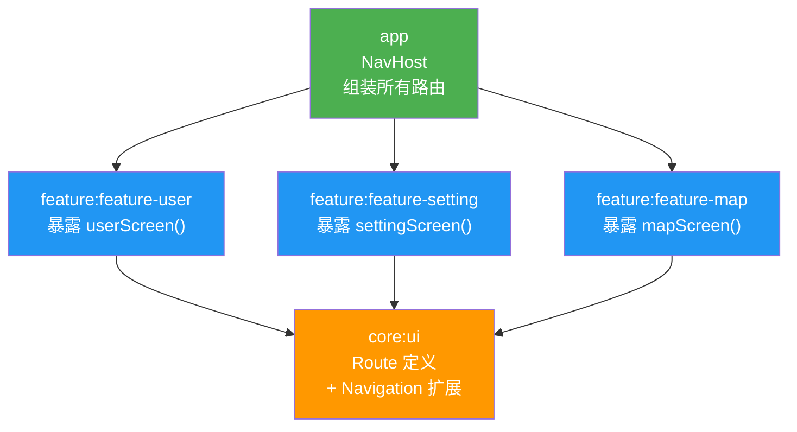

# 多模块 Navigation 路由方案

## 核心问题

Feature 模块之间**不能互相依赖**（架构规则禁止），但需要互相跳转。
如何让 `feature-user` 跳转到 `feature-setting`？

## 设计思路



**三层职责划分：**

| 层级 | 职责 |
|------|------|
| **core:ui** | 定义所有 Route 常量/对象（全局可见） |
| **feature** | 暴露 `NavGraphBuilder.xxxScreen()` 扩展函数，不持有 NavController |
| **app** | 创建 NavHost，组装所有 feature 的路由，处理跳转逻辑 |

---

## 实现方式

### 第 1 步：添加依赖

在 [libs.versions.toml](file:///d:/Project/demo/android-scaffold-verify/gradle/libs.versions.toml) 中添加：

```toml
[versions]
navigation = "2.8.9"

[libraries]
androidx-navigation-compose = { group = "androidx.navigation", name = "navigation-compose", version.ref = "navigation" }
```

### 第 2 步：core:ui 定义 Route

```kotlin
// core:ui/src/main/java/com/lhz/ui/navigation/Routes.kt
package com.lhz.ui.navigation

// 方式一：简单字符串常量
object Routes {
    const val USER = "user"
    const val SETTING = "setting"
    const val MAP = "map"
    const val BLE = "ble"
}

// 方式二：Type-Safe（推荐，Navigation 2.8+）
// 使用 @Serializable 数据类
// @Serializable object UserRoute
// @Serializable data class UserDetailRoute(val userId: Long)
```

`core:ui` 的 [build.gradle.kts](file:///d:/Project/demo/android-scaffold-verify/build.gradle.kts) 添加 navigation 依赖：

```kotlin
api(libs.androidx.navigation.compose)  // 用 api 让下游模块也能访问
```

### 第 3 步：每个 Feature 暴露导航扩展函数

```kotlin
// feature:feature-user/src/.../UserNavigation.kt
package com.lhz.feature.user

import androidx.navigation.NavGraphBuilder
import androidx.navigation.compose.composable
import com.lhz.ui.navigation.Routes

// 暴露给 app 层组装用
fun NavGraphBuilder.userScreen(
    onNavigateToSetting: () -> Unit   // 通过回调解耦跳转
) {
    composable(Routes.USER) {
        UserScreen(
            onSettingClick = onNavigateToSetting
        )
    }
}
```

```kotlin
// feature:feature-setting/src/.../SettingNavigation.kt
package com.lhz.feature.setting

import androidx.navigation.NavGraphBuilder
import androidx.navigation.compose.composable
import com.lhz.ui.navigation.Routes

fun NavGraphBuilder.settingScreen(
    onBack: () -> Unit
) {
    composable(Routes.SETTING) {
        SettingScreen(onBack = onBack)
    }
}
```

> [!IMPORTANT]
> Feature 模块**不持有 NavController**，跳转逻辑通过回调参数（如 `onNavigateToSetting`）上抛给 app 层。
> 这样 feature 之间完全解耦，互不感知。

### 第 4 步：app 层组装 NavHost

```kotlin
// app/src/.../AppNavHost.kt
package com.lhz.scaffold

import androidx.compose.runtime.Composable
import androidx.compose.ui.Modifier
import androidx.navigation.compose.NavHost
import androidx.navigation.compose.rememberNavController
import com.lhz.feature.user.userScreen
import com.lhz.feature.setting.settingScreen
import com.lhz.ui.navigation.Routes

@Composable
fun AppNavHost(modifier: Modifier = Modifier) {
    val navController = rememberNavController()

    NavHost(
        navController = navController,
        startDestination = Routes.USER,
        modifier = modifier
    ) {
        // 组装各 Feature 的路由
        userScreen(
            onNavigateToSetting = {
                navController.navigate(Routes.SETTING)
            }
        )

        settingScreen(
            onBack = { navController.popBackStack() }
        )

        // mapScreen(...)
        // bleScreen(...)
    }
}
```

```kotlin
// app/src/.../MainActivity.kt
class MainActivity : ComponentActivity() {
    override fun onCreate(savedInstanceState: Bundle?) {
        super.onCreate(savedInstanceState)
        enableEdgeToEdge()
        setContent {
            RoadtestTheme {
                Scaffold(modifier = Modifier.fillMaxSize()) { innerPadding ->
                    AppNavHost(modifier = Modifier.padding(innerPadding))
                }
            }
        }
    }
}
```

---

## 依赖关系总结

```
core:ui
  └── api(navigation-compose)    ← 定义 Routes + 暴露 Navigation API

feature:feature-user
  └── 依赖 core:ui（自动）        ← 使用 Routes、NavGraphBuilder

feature:feature-setting
  └── 依赖 core:ui（自动）        ← 使用 Routes、NavGraphBuilder

app
  ├── 依赖 feature:feature-user   ← 组装路由
  ├── 依赖 feature:feature-setting
  └── 依赖 navigation-compose     ← NavHost + NavController
```

> [!TIP]
> 因为 `scaffold.android.feature` 插件已自动依赖 `core:ui`，
> 所以 feature 模块**不需要手动添加** navigation 依赖，直接通过 `core:ui` 的 `api` 传递获得。

---

## 带参数的路由跳转

```kotlin
// core:ui - 定义带参路由
object Routes {
    const val USER_DETAIL = "user/{userId}"
    fun userDetail(userId: Long) = "user/$userId"
}

// feature-user - 暴露带参 composable
fun NavGraphBuilder.userDetailScreen(onBack: () -> Unit) {
    composable(
        route = Routes.USER_DETAIL,
        arguments = listOf(navArgument("userId") { type = NavType.LongType })
    ) { backStackEntry ->
        val userId = backStackEntry.arguments?.getLong("userId") ?: 0L
        UserDetailScreen(userId = userId, onBack = onBack)
    }
}

// app - 跳转时传参
navController.navigate(Routes.userDetail(userId = 42))
```
