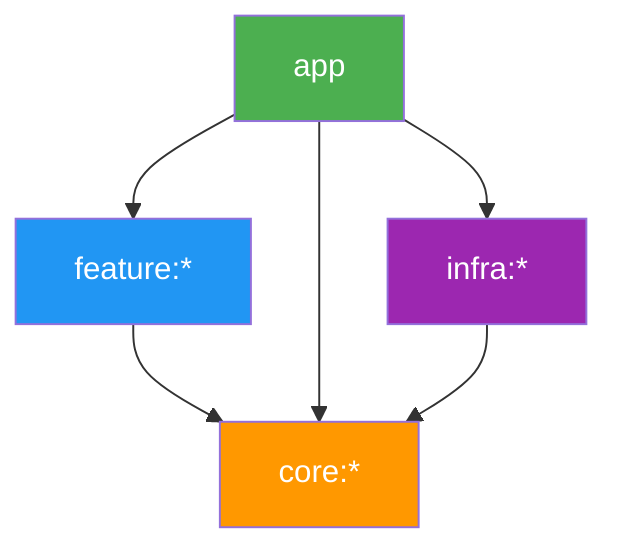
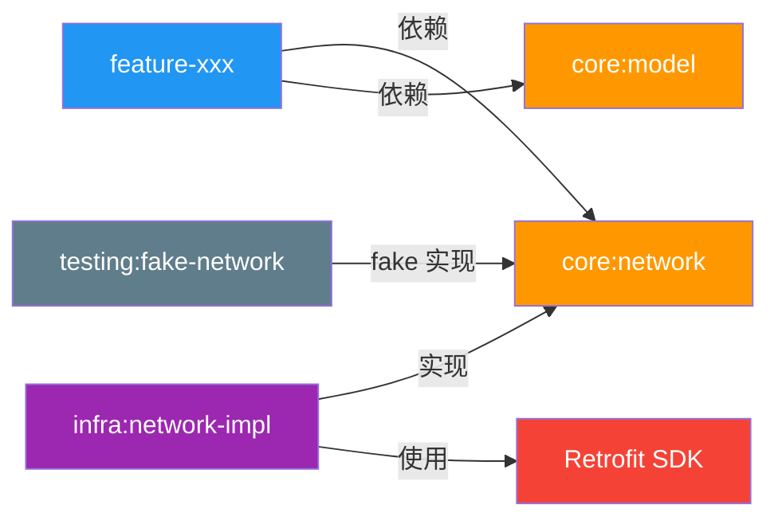

# Android 脚手架开发指南

## 架构概览



| 层级 | 职责 | 可依赖 | 不可依赖 |
|------|------|--------|----------|
| **app** | 壳工程，组装各模块 | feature, core, infra | — |
| **feature** | 业务功能 | core | feature, infra |
| **core** | 抽象/接口层 | core | feature, infra |
| **infra** | SDK 实现层 | core | feature |
| **testing** | 测试 fake 实现 | core | feature, infra |

> [!IMPORTANT]
> 架构规则由 [ArchitectureRulesPlugin](file:///d:/Project/demo/android-scaffold-verify/build-logic/src/main/kotlin/com/lhz/buildlogic/ArchitectureRulesPlugin.kt#7-84) 自动校验，违规依赖会导致编译失败。

---

## 1. 添加新的 Feature 模块

### 步骤 1：创建模块目录

在 Android Studio 中：**File → New → New Module → Android Library**，
模块名如 `feature-chat`，放在 `feature/` 目录下。

### 步骤 2：配置 build.gradle.kts

将自动生成的内容替换为：

```kotlin
plugins {
    id("scaffold.android.feature")       // 自动配置 library + kotlin + 依赖 core:ui
    // id("scaffold.android.compose")    // 需要 Compose 时取消注释
}

android {
    namespace = "com.lhz.feature.chat"
}

dependencies {
    // 只添加此 feature 特有的依赖
    implementation(project(":core:model"))
    implementation(project(":core:network"))
}
```

### 步骤 3：注册模块

在根目录 [settings.gradle.kts](file:///d:/Project/demo/android-scaffold-verify/settings.gradle.kts) 中添加：

```kotlin
include(":feature:feature-chat")
```

### 步骤 4：在 app 中引用

在 [app/build.gradle.kts](file:///d:/Project/demo/android-scaffold-verify/app/build.gradle.kts) 的 `dependencies` 中添加：

```kotlin
implementation(project(":feature:feature-chat"))
```

---

## 2. 添加新的 Core 模块

Core 模块用于定义**接口和数据模型**，不包含 SDK 实现。

```kotlin
// core/chat/build.gradle.kts
plugins {
    id("scaffold.android.library")
}

android {
    namespace = "com.lhz.chat"
}

dependencies {
    implementation(project(":core:model"))    // 如需通用数据模型
    implementation(project(":core:common"))   // 如需工具类
}
```

> [!TIP]
> Core 模块应只包含 **interface、data class、sealed class** 等抽象定义，不要引入具体 SDK。

---

## 3. 添加新的 Infra 模块

Infra 模块用于**实现 Core 层的接口**，可以依赖具体 SDK。

```kotlin
// infra/chat-impl/build.gradle.kts
plugins {
    id("scaffold.android.library")
}

android {
    namespace = "com.lhz.chat.impl"
}

dependencies {
    implementation(project(":core:chat"))     // 实现 core 中的接口

    // 这里可以引入具体 SDK
    implementation("io.getstream:stream-chat-android:6.0.0")
}
```

---

## 4. 添加第三方依赖

### 推荐方式：通过 Version Catalog 统一管理

**步骤 1**：在 [libs.versions.toml](file:///d:/Project/demo/android-scaffold-verify/gradle/libs.versions.toml) 中添加版本和库：

```toml
[versions]
retrofit = "2.9.0"
okhttp = "4.12.0"
hilt = "2.51"

[libraries]
retrofit-core = { group = "com.squareup.retrofit2", name = "retrofit", version.ref = "retrofit" }
retrofit-gson = { group = "com.squareup.retrofit2", name = "converter-gson", version.ref = "retrofit" }
okhttp-core = { group = "com.squareup.okhttp3", name = "okhttp", version.ref = "okhttp" }
okhttp-logging = { group = "com.squareup.okhttp3", name = "logging-interceptor", version.ref = "okhttp" }
hilt-android = { group = "com.google.dagger", name = "hilt-android", version.ref = "hilt" }

[plugins]
hilt = { id = "com.google.dagger.hilt.android", version.ref = "hilt" }
```

**步骤 2**：在模块的 [build.gradle.kts](file:///d:/Project/demo/android-scaffold-verify/build.gradle.kts) 中使用：

```kotlin
dependencies {
    implementation(libs.retrofit.core)
    implementation(libs.retrofit.gson)
    implementation(libs.okhttp.logging)
}
```

> [!WARNING]
> **不要**在模块中直接硬编码版本号（如 `implementation("com.squareup.retrofit2:retrofit:2.9.0")`），
> 始终通过 Version Catalog 管理，确保全项目版本一致。

---

## 5. Convention Plugin 使用指南

### 可用的 Convention Plugin

| Plugin ID | 用途 | 自动配置内容 |
|-----------|------|-------------|
| `scaffold.android.application` | app 模块 | AGP Application + Kotlin + compileSdk/minSdk/targetSdk + Java 17 |
| `scaffold.android.library` | 所有 library 模块 | AGP Library + Kotlin + compileSdk/minSdk + Java 17 + proguard |
| `scaffold.android.feature` | feature 模块 | = `scaffold.android.library` + 自动依赖 `:core:ui` |
| `scaffold.android.compose` | 需要 Compose 的模块 | Kotlin Compose Plugin + buildFeatures.compose = true |

### 组合使用示例

```kotlin
// 带 Compose 的 Feature 模块
plugins {
    id("scaffold.android.feature")
    id("scaffold.android.compose")
}

// 带 Compose 的 Core UI 模块
plugins {
    id("scaffold.android.library")
    id("scaffold.android.compose")
}

// 纯 Kotlin 的 Core 模块（无 Compose）
plugins {
    id("scaffold.android.library")
}
```

### 修改全局配置

如需修改所有模块的 compileSdk、minSdk、Java 版本等，只需修改一个文件：

[Versions.kt](file:///d:/Project/demo/android-scaffold-verify/build-logic/src/main/kotlin/internal/Versions.kt)

```kotlin
object Versions {
    const val COMPILE_SDK = 36
    const val MIN_SDK = 24        // 改这里即可全局生效
    const val TARGET_SDK = 36
    const val JAVA_VERSION = 17
}
```

---

## 6. 典型开发流程示例

以「添加网络请求功能」为例：

```
1. core:network     → 定义 ApiService 接口
2. core:model       → 定义 Response 数据模型
3. infra:network-impl → 用 Retrofit 实现 ApiService
4. feature:feature-xxx → 调用 ApiService 展示数据
5. testing:fake-network → 提供 FakeApiService 用于测试
```



---

## 7. 常见问题

### Q: Feature 模块之间如何通信？

通过 **core 层的共享接口**或 **app 层的导航路由**，不要直接互相依赖。

### Q: 新增一个依赖需要改几个文件？

最少 2 个：[libs.versions.toml](file:///d:/Project/demo/android-scaffold-verify/gradle/libs.versions.toml)（声明依赖）+ 目标模块的 [build.gradle.kts](file:///d:/Project/demo/android-scaffold-verify/build.gradle.kts)（引用依赖）。

### Q: 如何给 Convention Plugin 添加新能力？

在 [build-logic/src/main/kotlin/](file:///d:/Project/demo/android-scaffold-verify/build-logic/src/main/kotlin/) 下新建 Plugin 类，
然后在 [build-logic/build.gradle.kts](file:///d:/Project/demo/android-scaffold-verify/build-logic/build.gradle.kts) 的 `gradlePlugin` 块中注册。

### Q: 如何引入 Hilt 等需要 Plugin 的框架？

1. 在 [libs.versions.toml](file:///d:/Project/demo/android-scaffold-verify/gradle/libs.versions.toml) 添加 plugin 和 library
2. 在 [build-logic/build.gradle.kts](file:///d:/Project/demo/android-scaffold-verify/build-logic/build.gradle.kts) 的 `dependencies` 中添加 Hilt 的 Gradle Plugin
3. 创建 `HiltConventionPlugin` 统一配置
4. 在需要的模块中 [id("scaffold.android.hilt")](file:///d:/Project/demo/android-scaffold-verify/build-logic/src/main/kotlin/com/lhz/buildlogic/ArchitectureRulesPlugin.kt#58-83) 即可
